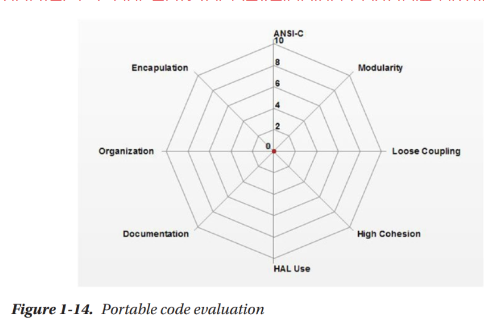
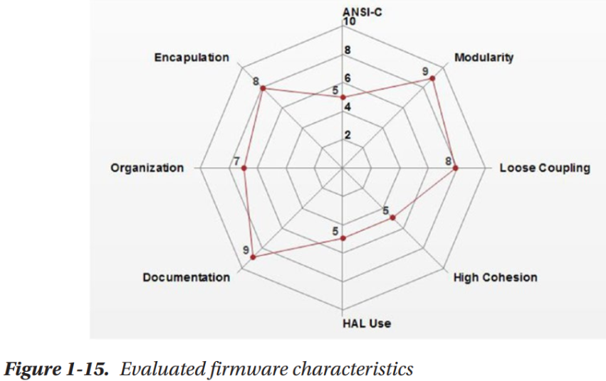

# Principios para la Creación de Librerías en C

## Objetivo

Establecer lineamientos claros para desarrollar librerías en C que sean **modulares, reutilizables, y fáciles de mantener**, orientadas a sistemas embebidos sobre STM32.

---

## Lineamientos de Programación

* **Claridad y legibilidad:** código con nombres expresivos.
* **Modularidad:** separación clara de responsabilidades.
* **Encapsulamiento:** ocultar detalles de implementación.
* **Robustez:** evitar errores comunes (null pointers, etc.).
* **Reusabilidad:** diseñar pensando en múltiples instancias.
* **Configurabilidad:** permitir macros de configuración cuando sea útil.
* **Eficiencia:** evitar redundancias y operaciones costosas.

---

## Evaluación de Portabilidad y Calidad del Código

Los siguientes criterios del gráfico de evaluación de código portátil ayudan a producir librerías de alta calidad:

* **ANSI-C Compliance:** Asegura que el código sea portable entre diferentes compiladores.
* **Modularidad:** Separa las responsabilidades y promueve el desarrollo independiente de cada módulo.
* **Loose Coupling (Bajo Acoplamiento):** Reduce las dependencias entre módulos, facilitando la reutilización y el mantenimiento.
* **High Cohesion (Alta Cohesión):** Cada módulo debe cumplir una función clara y bien definida.
* **HAL Use:** Utilizar HAL cuando sea apropiado permite adaptabilidad a cambios de hardware y mejora la portabilidad.
* **Documentación:** Explica claramente el propósito, entradas y salidas de cada función, así como estructuras de datos.
* **Organización:** Mantén una estructura de archivos consistente (`Lib/Inc`, `Lib/Src`, etc.) y nombres significativos.
* **Encapsulamiento:** Protege la implementación interna de cada módulo usando `static` y define una interfaz pública clara en los headers.

<p align="middle">
  
  
</p>

---

## Estructura General de una librería en C

Una librería en C debe estar compuesta por:

* Archivo de cabecera (`.h`) con la **interfaz pública**.
* Archivo de implementación (`.c`) con la **lógica interna**.

---

### Estructura del Archivo `.h` (Ejemplo: LED Driver)

```c
#ifndef LED_DRIVER_H
#define LED_DRIVER_H

#include <stdint.h>
#include "main.h"

// Tipos de datos públicos
typedef struct {
    GPIO_TypeDef *port;
    uint16_t pin;
} led_handle_t;

// API pública
void led_init(led_handle_t *led);
void led_on(led_handle_t *led);
void led_off(led_handle_t *led);
void led_toggle(led_handle_t *led);

#endif // LED_DRIVER_H

```

#### Componentes clave:

* **Guardas de inclusión** (`#ifndef/#define`)
* **Dependencias mínimas necesarias** (`stdint.h`, etc.)
* **Declaraciones públicas**
* Comentarios claros y explicativos

---

### Estructura del Archivo `.c`

```c
#include "led_driver.h"

void led_init(led_handle_t *led) {
    HAL_GPIO_WritePin(led->port, led->pin, GPIO_PIN_RESET);
}

void led_on(led_handle_t *led) {
    HAL_GPIO_WritePin(led->port, led->pin, GPIO_PIN_SET);
}

void led_off(led_handle_t *led) {
    HAL_GPIO_WritePin(led->port, led->pin, GPIO_PIN_RESET);
}

void led_toggle(led_handle_t *led) {
    HAL_GPIO_TogglePin(led->port, led->pin);
}

```

#### Consideraciones:

* Incluir su propio `.h`
* Variables o funciones internas pueden declararse `static`
* Comentarios en secciones complejas

---

## Buenas Prácticas

* Reutiliza la inicialización generada por CubeMX para GPIO.
* Mantén la lógica de la librería independiente del flujo de `main()`.
* Documenta cada función de la API en el `.h`.

---

## Ejemplo práctico aplicado: `led_driver.c/h` para manejar múltiples LEDs usando handles configurados por CubeMX.

### Uso de la librería en `main.c`

Agrega las lineas de codigo a continuación en las secciones indicadas del archivo `main.c`.

```c

/* USER CODE BEGIN Includes */
#include "led_driver.h"
/* USER CODE END Includes */

/* USER CODE BEGIN PV */
led_handle_t led1 = { .port = GPIOA, .pin = GPIO_PIN_5 }; // LD2 en NUCLEO-L476RG
/* USER CODE END PV */

int main(void)
{
  /* USER CODE BEGIN 2 */
  led_init(&led1);
  /* USER CODE END 2 */

  /* Infinite loop */
  /* USER CODE BEGIN WHILE */
  while (1) {
    led_toggle(&led1);
    HAL_Delay(500);
    /* USER CODE END WHILE */

    /* USER CODE BEGIN 3 */
  }
  /* USER CODE END 3 */
}

```

Este ejemplo muestra cómo integrar la librería `led_driver` dentro del archivo `main.c`, utilizando el pin PA5 ya configurado por STM32CubeMX para el LED de usuario.

### Ejercicio

1. Documentar la libreria de LED Driver.
2. Implementar de la misma manera el control del LED externo (LED_DOOR).

---

**Siguiente Paso:** [Implementación de una librería de buffer circular (RING_BUFFER.md)](RING_BUFFER.md)
