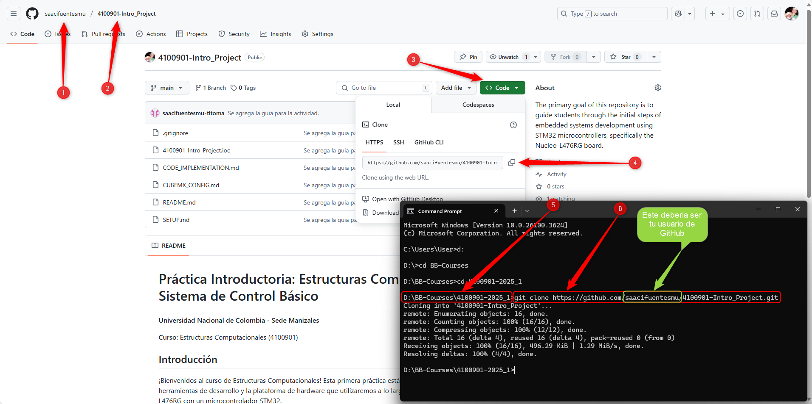

# Guía de Configuración del Entorno

Este documento te guiará a través de la instalación de las herramientas necesarias y la configuración inicial del repositorio del proyecto.

## 1. Herramientas Necesarias

Asegúrate de tener instaladas las siguientes herramientas en tu sistema operativo (Windows, macOS o Linux):

*   **Visual Studio Code Insiders (VS Code):** Un editor de código fuente moderno y extensible.
    *   Descargar [VS Code Insiders](https://code.visualstudio.com/insiders/)
    *   [Guía de Instalación](https://www.youtube.com/watch?v=8JCVAiSZAAM) (les recomiendo instalar *VS Code* ***Insiders*** en lugar de *VS Code*)
*   **STM32CubeCLT:** Conjunto de herramientas para entornos de desarrollo integrado (IDE).
    *   Descargar e Instalar [STM32CubeCLT (Command Line Tools)](https://www.st.com/en/development-tools/stm32cubeclt.html) 
*   **STM32CubeMX:** Herramienta gráfica para configuración de los microcontroladores y microprocesadores STM32.
    *   Descaragar e Instalar [STM32CubeMX (Code Generator)](https://www.st.com/en/development-tools/stm32cubemx.html) 
*   **Extensión STM32 VS Code Extension:** Proporciona integración con herramientas de STMicroelectronics dentro de VS Code.
    *   Instálala desde el Marketplace siguiendo este [video tutorial](https://www.youtube.com/watch?v=DLmbNfUh62E).
    *   *Nota:* Al configurar la extensión por primera vez, necesitas indicarle dónde encontrar `STM32CubeMX` y las herramientas de línea de comandos (`STM32CubeCLT`).
*   **Git:** Sistema de control de versiones distribuido.
    *   [Descargar Git](https://git-scm.com/downloads)
    *   Verifica la instalación abriendo una terminal o símbolo del sistema (CMD) y ejecutando: `git --version`

## 2. Configuración del Repositorio del Proyecto

Trabajaremos utilizando GitHub. Deberás crear tu propia copia (fork) de este repositorio y luego clonarla (descargarla) a tu máquina local.

### 2.1 Fork del Repositorio

1.  Navega a la página principal del repositorio de la práctica en GitHub: [4100901-Room_Control-CubeMX](https://github.com/saacifuentesmu/4100901-Room_Control-CubeMX).
2.  En la esquina superior derecha, haz clic en el botón **"Fork"**.
3.  Selecciona tu cuenta de GitHub como destino para el fork. Esto creará una copia del repositorio bajo tu nombre de usuario (ej. `https://github.com/TuUsuario/4100901-Room_Control-CubeMX`).

### 2.2 Clonar el Repositorio Forkeado

1.  Ve a la página de *tu* repositorio forkeado en GitHub (el que acabas de crear).
2.  Haz clic en el botón verde **"< > Code"**.
3.  Copia la URL HTTPS (algo como `https://github.com/TuUsuario/4100901-Room_Control-CubeMX.git`).
4.  Abre una terminal o Git Bash en el directorio donde deseas guardar tus proyectos del curso (ej. `Documentos/UNAL/Estructuras`).
5.  Ejecuta el comando `git clone` seguido de la URL que copiaste:
    ```bash
    git clone https://github.com/TuUsuario/4100901-Room_Control-CubeMX.git
    ```
6.  Esto descargará el repositorio a una nueva carpeta llamada `4100901-Room_Control-CubeMX`.



¡Listo! Tu entorno de desarrollo está preparado. Ahora puedes pasar a la siguiente sección para configurar el microcontrolador.

**Siguiente Paso:** [Configuración del Proyecto con STM32CubeMX (CUBEMX_CONFIG.md)](CUBEMX_CONFIG.md)
